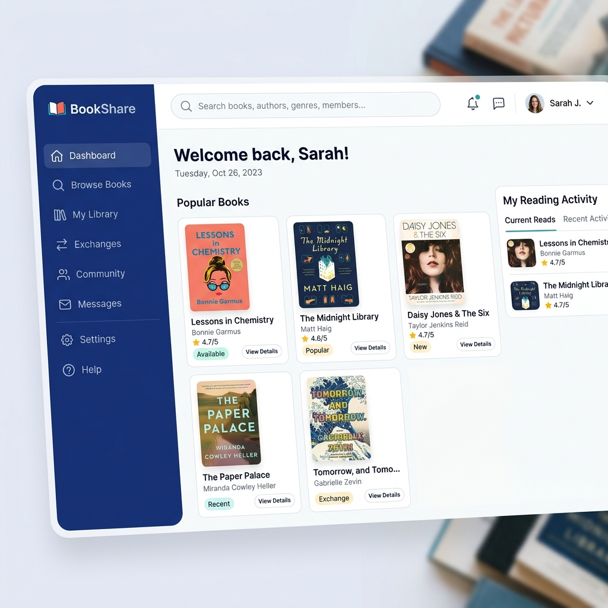

# 📚 BookShare - Modern Book Sharing Ecosystem

[](https://nextjs.org/)
[](https://www.python.org/)
[](https://flask.palletsprojects.com/)
[](https://www.sqlite.org/)



## 🌟 Overview

**BookShare** is a full-stack web application designed to bridge the gap between book lovers. Whether you have physical copies gathering dust or digital PDFs you want to share, BookShare provides a seamless platform for borrowing, lending, and managing your personal library within a community.

Built with a high-performance **Next.js** frontend and a robust **Flask** backend, it offers a secure and interactive experience for users to discover their next great read.

---

## ✨ Key Features

- 👤 **User Authentication**: Secure login and registration with personalized profiles.
- 📖 **Hybrid Library**: Support for both **Physical** (coordinate meetups) and **Digital** (PDF downloads) books.
- 🤝 **Borrowing System**: Request-based workflow for borrowing physical books with status tracking (Pending, Accepted, Rejected, Returned).
- 🔔 **Real-time Notifications**: Stay updated on borrow requests, status changes, and community activity.
- 🛡️ **Admin Dashboard**: Comprehensive management of users, books, and reports.
- 📱 **Responsive Design**: Fully optimized for mobile, tablet, and desktop viewing.

---

## 🛠️ Tech Stack

### Frontend
- **Framework**: [Next.js](https://nextjs.org/) (App Router)
- **Styling**: Vanilla CSS / Tailwind CSS (Optional)
- **State Management**: React Context API
- **Icons**: [Lucide React](https://lucide.dev/)

### Backend
- **Framework**: [Flask](https://flask.palletsprojects.com/)
- **Database**: SQLite (SQLAlchemy ORM)
- **Authentication**: Flask-Login
- **Security**: Werkzeug Hashing

---

## 🚀 Getting Started

### Prerequisites
- [Node.js](https://nodejs.org/) (v18+)
- [Python](https://www.python.org/) (v3.10+)

### 1. Setup Backend
```bash
cd backend
python -m venv venv
# Windows:
.\venv\Scripts\activate
# Unix/macOS:
source venv/bin/activate

pip install -r requirements.txt
python app.py
```
*The backend will run on `http://localhost:5000`.*

### 2. Setup Frontend
```bash
cd frontend
npm install
npm run dev
```
*The frontend will run on `http://localhost:3000`.*

---

## 📁 Project Structure

```text
bookshare/
├── backend/            # Flask API & Database
│   ├── routes/         # API Endpoints
│   ├── models.py       # Database Schema
│   ├── app.py          # Entry Point
│   └── bookshare.db    # SQLite Database
├── frontend/           # Next.js Application
│   ├── app/            # Routes & Layouts
│   ├── components/     # Reusable UI Elements
│   └── public/         # Static Assets
└── README.md           # Project Documentation
```

---

## 🛡️ License

Distributed under the MIT License. See `LICENSE` for more information.

---

<p align="center">
  Made with ❤️ for Book Lovers
</p>
